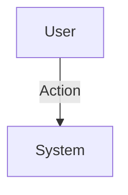

# [System Architecture]

## Document Information

- Document ID: [DOC-ID]
- Project: [Project Name]
- Version: [0.0.0]
- Status: Draft
- Owner: [Architecture Team]
- Review Cycle: Bi-annually
- Last Updated: [YYYY-MM-DD]

## 1. Purpose
[Defines the structural design, boundaries, and integrations of the system.]

## 2. System Overview
[High-level description of the system's role.]

## 3. Context Diagram

## 4. Component Design
[Module definitions and bounded contexts.]

## 5. Technology Stack
[Must conform to STD-004 Architecture Principles.]

## 6. Data Flow & Security
[How data traverses boundaries securely.]

## Related Standards
- [STD-001: Documentation Standard](../standards/documentation-standard.md)
- [STD-004: Architecture Principles](../standards/architecture-principles.md)

## References
- [DOCUMENT_INDEX](../DOCUMENT_INDEX.md)

## Revision History
| Version | Date | Author | Description |
| ------- | ---- | ------ | ----------- |
| 1.0.0 | [YYYY-MM-DD] | [Author] | Initial Draft |
