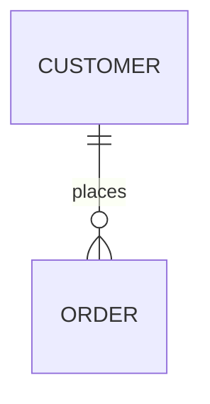

# [Database Schema Design]

## Document Information

- Document ID: [DOC-ID]
- Project: [Project Name]
- Version: [0.0.0]
- Status: Draft
- Owner: [Data Engineering]
- Review Cycle: Annually
- Last Updated: [YYYY-MM-DD]

## 1. Purpose
[Defines the relational or NoSQL data models for this bounded context.]

## 2. ERD (Entity Relationship Diagram)

## 3. Tables & Columns
| Table Name | Column | Type | Constraints | Description |
| ---------- | ------ | ---- | ----------- | ----------- |
| `users` | `id` | `UUID` | PK | Primary identifier |

## 4. Indexes & Performance
| Index Name | Table | Columns | Type |
| ---------- | ----- | ------- | ---- |
| `idx_users_email` | `users` | `email` | UNIQUE |

## Related Standards
- [STD-001: Documentation Standard](../standards/documentation-standard.md)
- [STD-003: Naming Conventions](../standards/naming-conventions.md)
- [STD-007: Database Standards](../standards/database-standards.md)

## References
- [DOCUMENT_INDEX](../DOCUMENT_INDEX.md)

## Revision History
| Version | Date | Author | Description |
| ------- | ---- | ------ | ----------- |
| 1.0.0 | [YYYY-MM-DD] | [Author] | Initial Draft |
